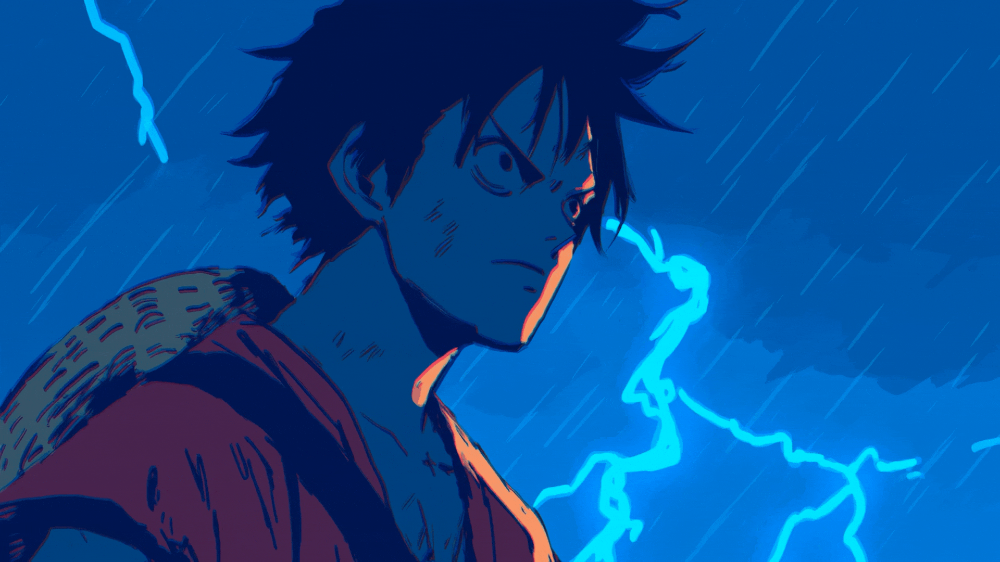

  

 

  

# Tech Stack

# Contribution Graph

---

# Contribution Snake

---

# Connect

<a href="mailto:jumonkalita90@gmail.com">Email</a> •
<a href="https://www.linkedin.com/in/juman-krishna-kalita-660717289/">LinkedIn</a>

<i>Design. Build. Scale.</i>

